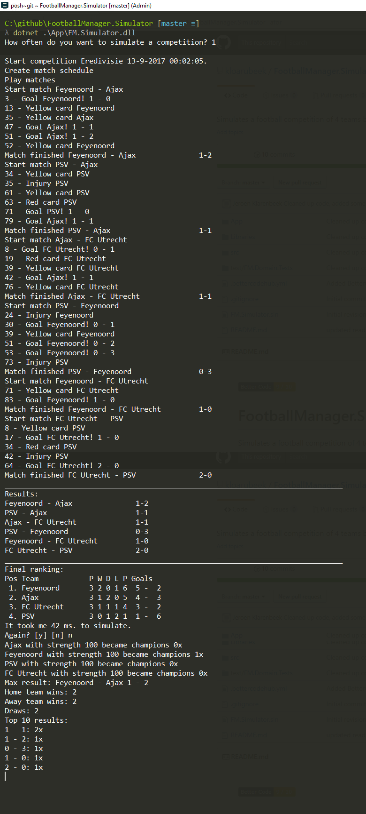

[](https://bettercodehub.com/)

# FootballManager.Simulator
Simulates a football competition of 4 teams based on strength.

## Pre-requisites
Be sure to install [.Net Core 2.0 Runtime](https://www.microsoft.com/net/download/core#/runtime). 

## Use
Clone the repository and run the console application via this command

```cmd
dotnet .\App\FM.Simulator.dll
```

Answer the question and it will run _x_ simulations of a competition. The competition consists of 4 teams:

Team       | Strength | Agggression
-----------|----------|------------
Ajax       | 100      | 10
Feyenoord  | 100      | 40
PSV        | 100      | 30
FC Utrecht | 100      | 20

The followoing result is shown for each simulation:
- Match events
- Final results of all 6 matches
- Final standing

The final result show:
- Match with the highest scoring.
- Number of times each team became champion
- Top 10 of most occuring score.

## Explanation
The simulator takes the team strength into account when calculating a match. The team aggression is used which team will get a yellow/ red card.
The following steps are executed per simulation

- Create a new competition
- Add 4 teams to the competition
- Generate a single schedule that produces 6 matches. Teams play 3 matches, the home/ away team is random.
- Simulate each match
  - Determine match length: 90 minutes + 2-5 minutes of injury time
  - For each minute pick a random 'match event' based on this table and the team strength or aggression (3rd column):
  
  Event       | Probability | Based on
  ------------|-------------|---------
  Yellow card | 3           | Team agression
  Red card    | 1           | Team agression
  Goal        | 2           | Team strength
  Injury      | 1           | Team strength (todo: move to opponent agression)
  Nothing     | 93          | -

  __Example:__
  In the 4rd minute a goal event is simulated. Both team strengths are taken into account to determine which teams scores.
  - After the match is finished, the competition standing is updated.
  - After all 6 matched are played, the final position is calculated, based on:
    - Most Points
    - Most Goal difference (NL: doelsaldo)
    - Most Goals scored
    - Result between the 2 teams
    If all is the same, the position will be equal. This simulator doesn't support 3 or more teams to finish equal.
  - Match results are printed.
  - Final competition standing is printed.

## Expectations
If you run the simulation a 1000 times, the expectation is that each team becomes champion +/- 250 times (in case all teams have equal strength).

## Try out other strengths

```cmd
dotnet .\App\FM.Simulator.dll --teamStrengths 500,100,1,10
```

This translates to Ajax (500), Feyenoord (100), PSV (1), FC Utrecht (10)

## Sneak preview

